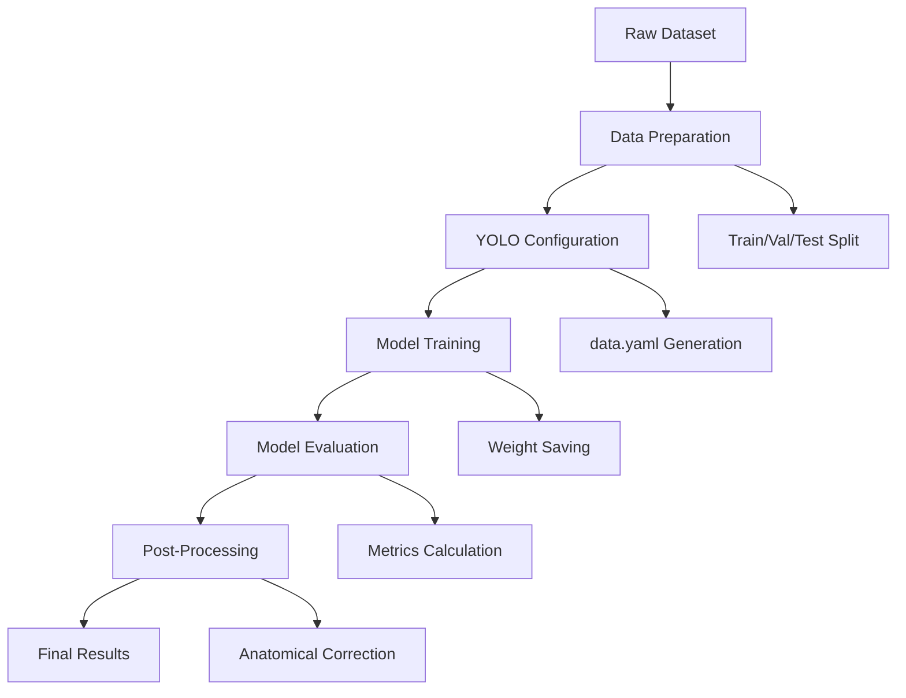

# Design Document

## Overview

The tooth numbering system is designed as a modular YOLO-based computer vision pipeline that processes dental panoramic images to detect and classify teeth according to the FDI numbering system. The system consists of data management, model training, evaluation, and post-processing components that work together to provide accurate tooth detection with anatomically correct numbering.

## Architecture

The system follows a pipeline architecture with four main stages:

1. **Data Pipeline**: Handles dataset organization, splitting, and YOLO configuration
2. **Training Pipeline**: Manages YOLO model training with proper configuration and monitoring
3. **Evaluation Pipeline**: Performs comprehensive model assessment and metrics calculation
4. **Post-Processing Pipeline**: Applies anatomical logic and generates final outputs



## Components and Interfaces

### DataManager Component
- **Purpose**: Handles dataset organization and splitting
- **Key Methods**:
  - `split_dataset(train_ratio=0.8, val_ratio=0.1, test_ratio=0.1)`
  - `validate_image_label_pairs()`
  - `verify_class_distribution()`
- **Inputs**: Raw image and label directories
- **Outputs**: Organized train/val/test directories

### ConfigurationManager Component
- **Purpose**: Generates YOLO training configuration
- **Key Methods**:
  - `create_data_yaml(train_path, val_path, test_path, class_names)`
  - `validate_paths()`
  - `map_fdi_classes()`
- **Inputs**: Dataset paths and FDI class mapping
- **Outputs**: data.yaml configuration file##
# YOLOTrainer Component
- **Purpose**: Manages YOLO model training process
- **Key Methods**:
  - `initialize_model(model_variant='yolov8s', pretrained_weights='yolov8s.pt')`
  - `train_model(epochs, batch_size, img_size=640)`
  - `save_training_artifacts(logs, weights, metrics)`
- **Inputs**: Training configuration and dataset paths
- **Outputs**: Trained model weights, training logs, metrics

### ModelEvaluator Component
- **Purpose**: Comprehensive model performance assessment
- **Key Methods**:
  - `evaluate_on_testset(model_path, test_data)`
  - `calculate_metrics(predictions, ground_truth)`
  - `generate_confusion_matrix()`
  - `create_prediction_visualizations()`
- **Inputs**: Trained model and test dataset
- **Outputs**: Performance metrics, confusion matrix, sample predictions

### PostProcessor Component
- **Purpose**: Applies anatomical logic and generates final outputs
- **Key Methods**:
  - `separate_arches(predictions, y_threshold)`
  - `divide_quadrants(predictions, x_midline)`
  - `apply_fdi_sequencing(quadrant_predictions)`
  - `handle_missing_teeth(predictions, spacing_threshold)`
- **Inputs**: Raw model predictions
- **Outputs**: Anatomically corrected FDI numbers

### FDIMapper Component
- **Purpose**: Manages FDI numbering system compliance
- **Key Methods**:
  - `create_class_mapping()`
  - `validate_fdi_numbers()`
  - `convert_class_to_fdi(class_id)`
- **Inputs**: Class IDs from model
- **Outputs**: Proper FDI tooth numbers

## Data Models

### ToothPrediction
```python
class ToothPrediction:
    bbox: BoundingBox          # x, y, width, height
    confidence: float          # prediction confidence
    class_id: int             # YOLO class ID (0-31)
    fdi_number: int           # FDI tooth number (11-48)
    quadrant: int             # 1-4 for FDI quadrants
    position: int             # 1-8 for tooth position in quadrant
```

### BoundingBox
```python
class BoundingBox:
    x_center: float           # normalized center x
    y_center: float           # normalized center y
    width: float              # normalized width
    height: float             # normalized height
```

### EvaluationMetrics
```python
class EvaluationMetrics:
    precision: Dict[int, float]    # per-class precision
    recall: Dict[int, float]       # per-class recall
    map_50: float                  # mAP at IoU 0.5
    map_50_95: float              # mAP at IoU 0.5-0.95
    confusion_matrix: np.ndarray   # 32x32 confusion matrix
```

## Error Handling

### Data Validation Errors
- **Missing Label Files**: Skip images without corresponding labels, log warnings
- **Invalid YOLO Format**: Validate label format, report malformed annotations
- **Class Distribution Issues**: Warn if classes are severely imbalanced

### Training Errors
- **GPU Memory Issues**: Implement batch size reduction and gradient accumulation
- **Convergence Problems**: Early stopping and learning rate scheduling
- **Weight Loading Failures**: Fallback to random initialization with warnings

### Post-Processing Errors
- **Anatomical Inconsistencies**: Log conflicts between spatial position and predicted class
- **Missing Quadrants**: Handle cases where entire quadrants have no detections
- **Overlapping Predictions**: Implement Non-Maximum Suppression (NMS) for cleanup

## Testing Strategy

### Unit Testing
- **DataManager**: Test dataset splitting ratios and file pairing validation
- **ConfigurationManager**: Verify YAML generation and path validation
- **FDIMapper**: Test class-to-FDI conversion accuracy
- **PostProcessor**: Test anatomical logic with synthetic prediction data

### Integration Testing
- **End-to-End Pipeline**: Test complete workflow from raw data to final results
- **Model Training**: Verify training loop with small dataset subset
- **Evaluation Pipeline**: Test metrics calculation with known ground truth

### Performance Testing
- **Training Speed**: Benchmark training time with different batch sizes
- **Inference Speed**: Measure prediction time per image
- **Memory Usage**: Monitor GPU and RAM consumption during training

### Validation Testing
- **Cross-Validation**: Implement k-fold validation for robust performance assessment
- **Anatomical Validation**: Test post-processing logic against dental expert knowledge
- **Edge Case Testing**: Test with images having missing teeth, dental work, or poor quality

## Implementation Considerations

### YOLO Variant Selection
- Support for YOLOv5, YOLOv8, and YOLOv11 through unified interface
- Model selection based on speed vs accuracy requirements
- Automatic hyperparameter tuning for optimal performance

### Data Augmentation Strategy
- Rotation, scaling, and brightness adjustments for dental images
- Preserve anatomical relationships during augmentation
- Class-balanced augmentation to handle imbalanced datasets

### Performance Optimization
- Mixed precision training for faster convergence
- Gradient accumulation for large effective batch sizes
- Model pruning and quantization for deployment optimization

### Anatomical Logic Implementation
- Configurable thresholds for arch separation and quadrant division
- Adaptive spacing detection for missing tooth identification
- Confidence-based filtering to reduce false positives